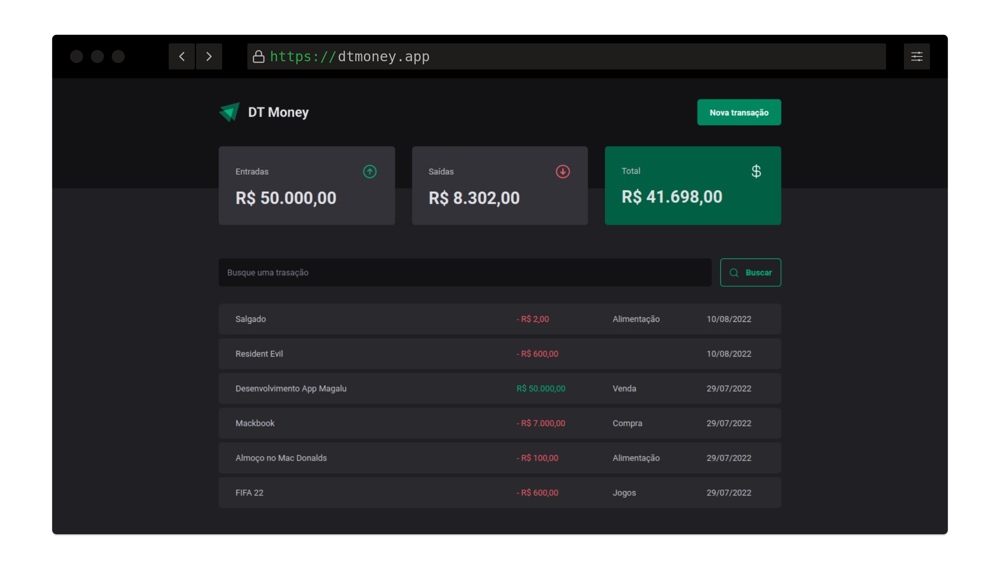

## Projeto

DT Money é uma aplicação para gerenciar nossas finanças, tendo um controle de entradas e saídas, com isso um resumo total.

## Sobre

Durante o desenvolvimento da aplicação implementamos uma conexão com uma API, para isso usamos a lib JSON Server para construir esse fake backend. E foi possível aprender como podemos performar nossas aplicações web usando algumas funcionalidades e hooks avançados do React.

## Funcionalidades

- Adicionar uma nova transação
- Buscar por uma transação

## Techs

- React JS
- Typescript
- Radix UI
- Styled Components
- JSON Server
- Phosphor React

## Uso

- Clone o repo `git clone https://github.com/ronaldprofile/rseat-dt-money`
- Instale as dependências `yarn`
- Execute o server `yarn dev`
